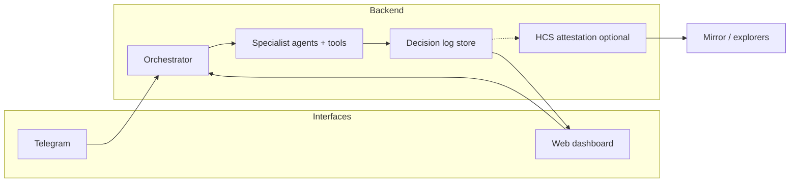

# B-Hive — Master plan (single source of truth)

This document is the **one coherent narrative** for product flow, interfaces, orchestration, logging, verifiability, strategies, and robustness. Other docs are **scoped** (see §0). If anything conflicts, **this file wins**.

---

## 0. Document map (no duplicate “plans”)

| Document | Purpose only |
|----------|----------------|
| **`Master-Plan.md`** (this file) | User flows, orchestration, logging, Hedera attestation hook, strategies, requirements, phases |
| [`Integration-and-Build-Guide.md`](./Integration-and-Build-Guide.md) | Hedera / Bonzo **technical** setup: RPC, mirror, contracts, wallets, env |
| [`Bonzo-Data-API-Env.md`](./Bonzo-Data-API-Env.md) | Bonzo **HTTP** base URLs (no API key) |
| [`Hackathon-Apex.md`](./Hackathon-Apex.md) | **Apex** track + bounty **submission** angle only |
| [`Plan.md`](./Plan.md) | Short **product brief** + tagline (points here for architecture) |
| [`Strategy-and-Roadmap.md`](./Strategy-and-Roadmap.md) | **Redirect** → this file + Hackathon |
| [`Implementation-Status.md`](./Implementation-Status.md) | **Living** target vs implemented checklist (update with every milestone) |

---

## 1. End-to-end flow (one story)

1. User sets **policy + strategy pack** (dashboard first; Telegram can deep-link).
2. **Orchestrator** runs a **defined pipeline** (not one free-form LLM session).
3. Each step emits **structured events** → **log** → dashboard timeline.
4. Sensitive **execution** requires **approval** (Telegram button or dashboard) unless policy allows auto within caps.
5. Optionally, each **run** or **step** publishes an **attestation** to Hedera (§6).

---

## 2. Interfaces — how we use Telegram (and what is *not* Telegram)

| Channel | Role | **Primary for** |
|---------|------|------------------|
| **Web dashboard** | System of record for **trust** | Full **pipeline view**, decision history, policy editor, strategy pack picker, PnL/risk summaries, tx links |
| **Telegram** | **Companion** — not the only UI | **Alerts**, **short commands** (“status”, “run check”), **approve / reject** for gated actions, **deep links** to dashboard for detail |

**You do *not* “talk to agents” only in Telegram** for a serious demo: the **orchestrator** runs agents; Telegram is one **client** into the same backend API. Chat-style Q&A can exist, but the **wow** is the **visible swarm pipeline** on the web.

**Resolved:** Dashboard = narrative + audit; Telegram = urgency + approvals + convenience.

---

## 3. Orchestration — target vs today

### Today (repo reality)

- **Specialist modules** and **tools** exist (Bonzo HTTP, mirror, Lend read-only RPC, LangChain tools, optional **Qdrant RAG** over repo docs, smoke script).
- There is **no** single **Orchestrator** that enforces a **fixed step graph** across agents yet.

### Target (what “orchestrated swarm” means)

- **`Orchestrator.run(pipelineId, context)`** executes a **declared ordered graph** (or state machine), e.g.  
  `Market → BonzoState → Risk → Strategy → [VaultKeeper if pack enables] → ExecutionGate`.
- Each node is a **pure-ish** function: **inputs** (prior outputs + policy + pack) → **outputs** (structured JSON) → **append event** to log.
- **LLM** is used **inside** nodes for **bounded** tasks (e.g. classify, explain, choose among **enumerated** actions), not to bypass the graph.

### Implementation requirement

- One file or module: **`pipeline` definition** (ordered steps + conditions) + **`Orchestrator`** loop that records every transition.

---

## 4. Decision & output logging (requirements)

### 4.1 Event schema (minimum)

Every orchestrator step should emit a **DecisionEvent** (store as JSON):

| Field | Meaning |
|-------|---------|
| `run_id` | UUID for one end-to-end run |
| `step_index` | Order in pipeline |
| `agent` | e.g. `market`, `risk`, `vault_keeper` |
| `inputs_digest` | Hash or redacted summary of inputs (no raw keys) |
| `outputs` | Structured result (numbers, enums, short text) |
| `tool_calls` | Optional: tool name + args hash + latency |
| `policy_id` / `pack_id` | Which rules were active |
| `llm_model` | If used |
| `ts` | ISO timestamp |
| `execution_intent` | `none` / `proposed` / `approved` / `submitted` / `failed` + tx ref if any |

### 4.2 Storage tiers

| Tier | Tech | Use |
|------|------|-----|
| **L0** | In-memory / ring buffer | Dev, single-process demo |
| **L1** | Append-only **file** or **SQLite** | Hackathon MVP — dashboard API reads this |
| **L2** | Postgres / cloud DB | Post-hackathon |

**Telegram** receives **summaries** derived from the latest events, not the full log.

---

## 5. Verifiability on Hedera — honest scope + “novel hook”

### What we can truthfully claim

- We **do not** put model weights or full prompts immutably on-chain.
- We **can** make **runs auditable** by anchoring **cryptographic commitments** to what the system **claimed** at decision time.

### Recommended pattern: **Attested decision runs** (HCS)

1. After each **run** (or after each **execution-relevant** step), compute  
   `commitment = SHA-256(canonical_json(decision_envelope))`  
   where `decision_envelope` includes: `run_id`, ordered step outputs, `policy_id`, `pack_id`, and hashes of tool payloads (not secrets).
2. Submit a **Hedera Consensus Service** message (e.g. dedicated **topic** per deployment or per user) containing at minimum:  
   `run_id`, `commitment`, `step_count`, `network`, optional **memo** URI pointing to **Mirror**-compatible metadata.
3. Anyone can: fetch topic messages from **Mirror** → recompute hash from a **disclosed** off-chain bundle → **verify match**.

**Novel / cool hook (pitch):** *“Every orchestrated run leaves a Hedera-attested receipt — not AI on-chain, but **tamper-evident agent accountability**.”*  
Optional extension: **dual hash** (hash of policy + hash of outputs) to show *rules + outcome* were fixed together.

### Limits

- **Integrity of off-chain bundle** is your responsibility (hosting, disclosure).
- HCS has **cost** (HBAR); batch **hourly** or **per execution** for demos.

Technical pointers: [Hedera Consensus Service](https://docs.hedera.com/hedera/sdks-and-apis/sdks/consensus-service), Mirror topic APIs in [Mirror REST](https://docs.hedera.com/hedera/sdks-and-apis/rest-api).

---

## 6. How “strategies” work (no confusion with Vault APIs)

| Concept | Definition |
|---------|------------|
| **Strategy pack** | **Versioned config** you ship: persona, risk caps, which pipeline branches are on (Lend-heavy, Vault-keeper on/off), auto-execute flags. Stored in **your** DB/JSON — **not** uploaded by strangers at MVP. |
| **Bonzo Lend** | Supply / borrow / health — via [Data API](https://docs.bonzo.finance/hub/developer/bonzo-lend/lend-data-api) + [contracts](https://docs.bonzo.finance/hub/developer/bonzo-lend/lend-contracts) + RPC. |
| **Vault keeper module** | **Apex bounty**: reads / decisions against [Vaults contracts](https://docs.bonzo.finance/hub/developer/bonzo-vaults-beta/vaults-contracts) — **contract-level**, no Bonzo “strategy API.” Enabled only when pack says so. |

**Resolved contradiction:** Vaults are **not** an open marketplace; they are a **curated module** + **keeper** for hackathon depth.

---

## 7. Robust agents (engineering requirements)

1. **Tools, not vibes** — agents call **typed tools** (HTTP, RPC, mirror); outputs validated (Zod / JSON schema).
2. **LLM role** — interpret + choose among **allowed** actions; never raw unsigned calldata without a **simulation / policy** gate.
3. **Deterministic shell** — orchestration order is **code**, not model-decided.
4. **Timeouts & retries** — external APIs (Bonzo, mirror) with backoff; fail visible in log.
5. **Idempotency** — execution steps use keys so retries don’t double-spend intent.
6. **Graduated autonomy** — default **recommend**; **auto** only inside explicit numeric caps in policy.
7. **Secrets** — keys never in events; only **hashes** and **account references** where needed.
8. **External context** — news, cross-chain, and real-world live data only via **allowlisted APIs** (documented providers, env keys, rate limits); see [`Implementation-Status.md`](./Implementation-Status.md) rows 39–42.

---

## 8. Phased implementation (requirements checklist)

### Phase 1 — Orchestrator + log (before “more agents”)

- [ ] `Pipeline` config + `Orchestrator.run`
- [ ] `DecisionEvent` append to **L1** (file or SQLite)
- [ ] HTTP API: `GET /runs`, `GET /runs/:id` for dashboard

### Phase 2 — Dashboard

- [ ] Timeline UI consuming API
- [ ] Policy + pack editor (minimal)

### Phase 3 — Telegram

- [ ] Webhook bot → same API: `/status`, approve/reject callbacks
- [ ] Push digest from last `run_id`

### Phase 4 — Hedera attestation (hook)

- [ ] HCS topic + `TopicMessageSubmit` after run or post-execution
- [ ] UI: “Verify on Mirror” link + instructions

### Phase 5 — Execution hardening

- [ ] Typed tx building for Lend / Vault actions per policy
- [ ] Simulation or dry-run where feasible

---

## 9. Apex alignment (pointer only)

Submission framing (tracks, keeper bounty): **[`Hackathon-Apex.md`](./Hackathon-Apex.md)**.  
Orchestration + logging + attestation **are** the story for **AI & Agents** + differentiation.

---

*Tagline (unchanged): Bonzo provides liquidity. We provide intelligence — with **attested** orchestration.*
